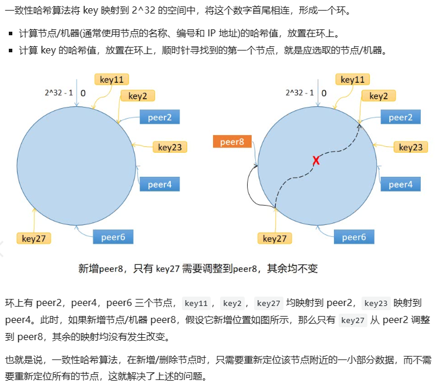

需要给定key，每次都能选择同一个节点， 从找精准的从group里面找到存除数的cache

维护一个圆圈（顺时针移动的第一个peer就是key应该存的位置）// 主要目的是当删除一个cache时候，或者添加一个适合，一定cache的量特别少

但是有倾斜问题，也及时上面图中的pear2的区域太大，

使用虚拟节点，也就是添加一些节点peer1-1、 peer1-2、 peer1-3，相当于把其他切点的部分抢到自己手上

