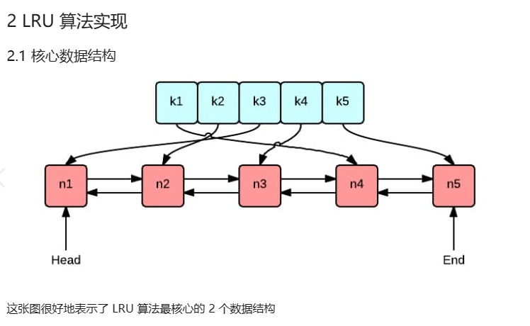
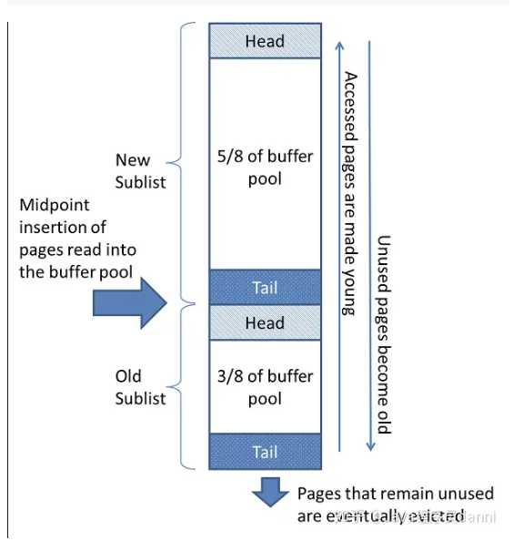

# 实现LRU

- 绿色的是字典(map)，存储键和值的映射关系。这样根据某个键(key)查找对应的值(value)的复杂是`O(1)`，在字典中插入一条记录的复杂度也是`O(1)`。
- 红色的是双向链表(double linked list)实现的队列。将所有的值放到双向链表中，这样，当访问到某个值时，将其移动到队尾的复杂度是`O(1)`，在队尾新增一条记录以及删除一条记录的复杂度均为`O(1)`。

## 几种算法

- LRU：最近最久未被使用，优先清理最近没有被使用的对象。使用一个最近使用时间降序的有序队列，优先清理队列对后的数据。与LFU的区别在于：LRU是按照最近使用使用的时间排序，LFU需要维护一个使用频次并用于排序。

- LFU：最近最少使用，优先清理最近最少使用的数据对象。使用一个使用次数降序的有序队列，优先清理队列最后的数据。

  // 其中LRU和LFU可以通过维护一个Hashmap来提高访问效率。

- **LRU-K**

  LRU-K的主要目的是为了解决LRU算法“缓存污染”的问题，其核心思想是将“最近使用过1次”的判断标准扩展为“最近使用过K次”。也就是说没有到达K次访问的数据并不会被缓存，这也意味着需要对于缓存数据的访问次数进行计数，并且访问记录不能无限记录，也需要使用替换算法进行替换。当需要淘汰数据时，LRU-K会淘汰第K次访问时间距当前时间最大的数据。

  > 偶发性的、周期性的批量操作会使临时数据涌入缓存，挤出热点数据，导致LRU热点命中率急剧下降，缓存污染情况比较严重。
  >
  > 加上一个有效期限，对超过有效期的访问记录，进行重新计数。// 一定时间内访问k次
  >
  > （可以使用懒处理，即每次对访问记录做处理时，先将记录中的访问时间与当前时间进行对比，如果时间间隔超过预设的值，则访问次数重置为1并更新时间戳，表示重新开始计数）

- 冷热分离

  - 第一次访问的数据从队列的3/8处位置插入；
  - 如果数据再次被访问，则移动到队列头部；
  - 如果数据没有被再访问，会逐步被热点数据驱逐向下移；
  - 淘汰尾部数据。

  

